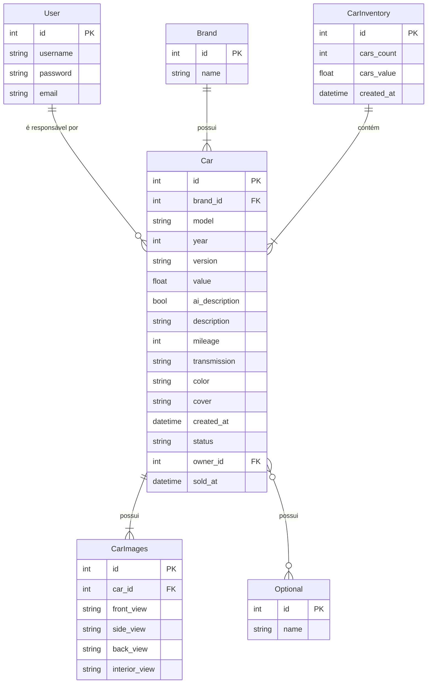
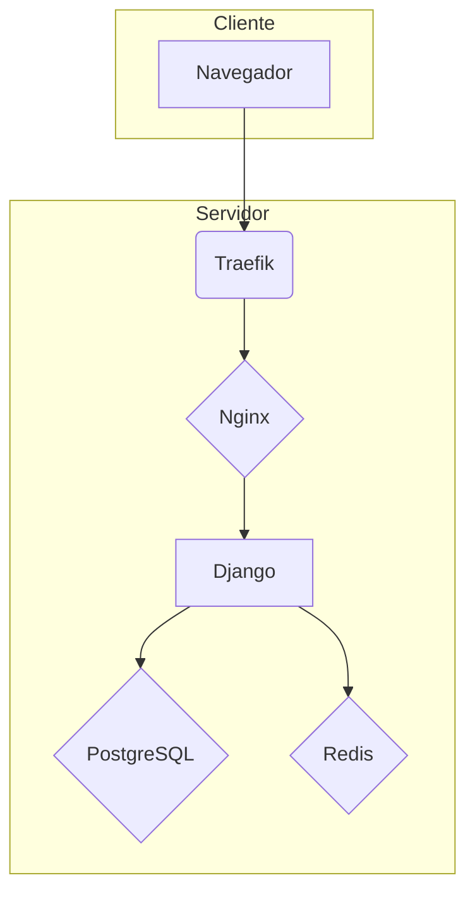
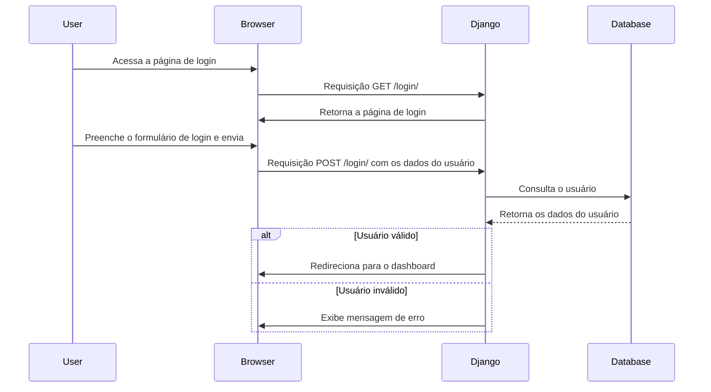
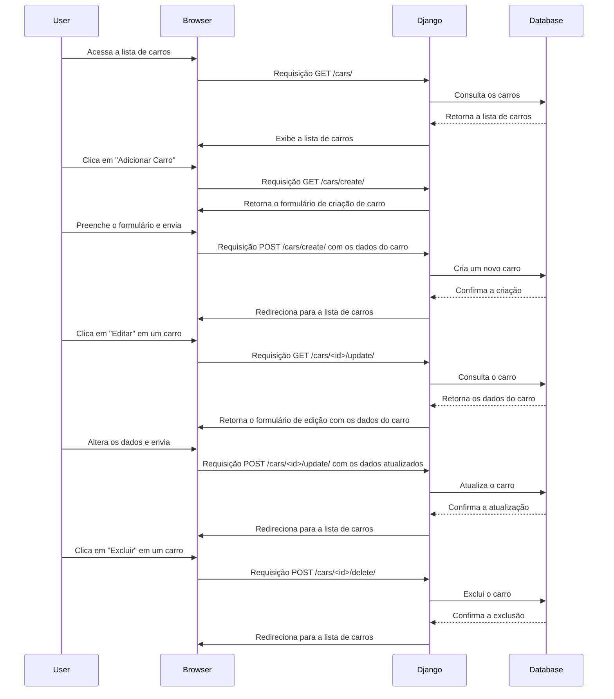
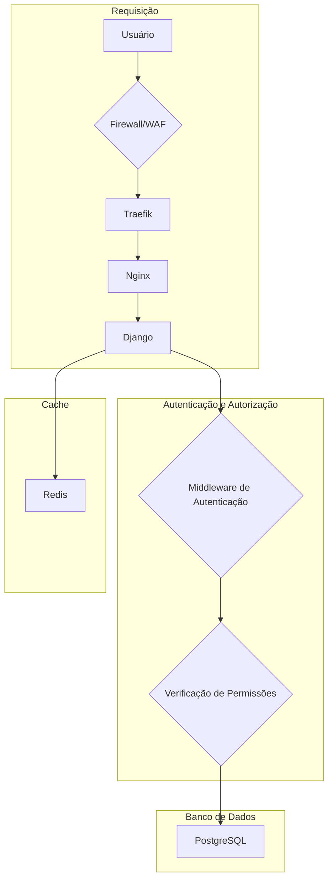

# Project Cars


<a href="https://cars.tiagoperon.com.br/">
    
</a>

<p align="center">
    
</p>

<br>

### 📝 Índice

- [Project Cars](#project-cars)
    - [📝 Índice](#-índice)
  - [📖 Descrição](#-descrição)
  - [✨ Funcionalidades](#-funcionalidades)
  - [🛠️ Tecnologias Utilizadas](#️-tecnologias-utilizadas)
  - [⚙️ Instalação e Execução](#️-instalação-e-execução)
  - [🚀 Como Utilizar](#-como-utilizar)
  - [Configuração do Projeto](#configuração-do-projeto)
  - [Guidelines e Padrões](#guidelines-e-padrões)
  - [Autenticação e Segurança](#autenticação-e-segurança)
  - [Modelagem do Sistema](#modelagem-do-sistema)
    - [Modelos de Dados (ERD)](#modelos-de-dados-erd)
    - [Arquitetura do Sistema](#arquitetura-do-sistema)
    - [Fluxo de Autenticação](#fluxo-de-autenticação)
    - [Fluxo CRUD de Carros](#fluxo-crud-de-carros)
    - [Fluxo de Segurança](#fluxo-de-segurança)
  - [📜 Créditos e Agradecimentos](#-créditos-e-agradecimentos)

<br>

## 📖 Descrição

__Este projeto__ é uma plataforma web full-stack desenhada para servir como a vitrine digital e sistema de gestão de inventário para uma concessionária de veículos seminovos.

* __Qual problema este projeto resolve?__
    O projeto resolve a necessidade de uma plataforma online para gerenciar e exibir um inventário de carros para venda. Ele permite que os usuários visualizem os carros disponíveis, seus detalhes e fotos, e também fornece uma área administrativa para gerenciar o inventário.
    <br>

* __Qual é o seu objetivo principal?__
    O objetivo principal do projeto é fornecer uma solução completa para o gerenciamento de uma concessionária de carros, desde o cadastro de novos veículos até a sua venda, com uma interface amigável para os clientes e uma área administrativa completa para os funcionários.
    <br>

* __Para quem este projeto é destinado?__
    Este projeto é destinado a concessionárias de carros, vendedores de carros e qualquer pessoa que queira ter uma plataforma online para exibir e gerenciar um inventário de carros para venda.
    <br>


## ✨ Funcionalidades

Este projeto implementa uma vasta gama de funcionalidades que demonstram as melhores práticas de desenvolvimento web moderno.


__Back-End & Área Administrativa (Django)__

* __Gestão de Inventário Completa (CRUD)__: Funcionalidades para Criar, Ler, Atualizar e Apagar veículos através de uma área de dashboard segura.

* __Sistema de Status Automático__: A lógica de negócio para o status do veículo (Disponível, Estoque Antigo, Vendido) é gerida automaticamente.

* __Sistema de Permissões Robusto__: Utilizadores normais (funcionários) só podem editar ou apagar os veículos pelos quais são responsáveis, enquanto administradores (staff) têm controlo total.

* __Registo com Aprovação__: Um sistema de registo de funcionários onde as novas contas precisam de ser aprovadas por um superutilizador no Django Admin antes de poderem aceder ao sistema.

* __Geração de Descrição com IA__: Integração com a API do Google Gemini para gerar descrições de marketing para os veículos automaticamente, acionada por um signal.

* __Processamento de Imagem Avançado__: Todas as imagens enviadas (tanto no front-end como no admin) são automaticamente redimensionadas para uma proporção padrão (com preenchimento, sem cortes) e convertidas para o formato moderno e eficiente WEBP.

* __Criação Dinâmica de Dados__: No formulário de cadastro de carros, os funcionários podem adicionar novas Marcas e Opcionais em tempo real através de um pop-up (modal) com AJAX, sem nunca sair da página.

* __Painel Administrativo Customizado__: O Django Admin foi personalizado para exibir os títulos e o logótipo da empresa, e para usar formulários customizados que aplicam a mesma lógica de processamento de imagem do site principal.
<br>

__Front-End & Experiência do Utilizador (UX)__

* __Design Responsivo__: Interface totalmente adaptável para desktops, tablets e dispositivos móveis, construída com Bootstrap.

* __Página Inicial Dinâmica__: Exibe os veículos mais recentes em destaque e conteúdo de marketing (vantagens, depoimentos) gerido dinamicamente pelo painel administrativo.

* __Listagem de Estoque Completa__: Página de inventário com paginação para uma navegação fluida, mesmo com um grande número de veículos.

* __Busca Inteligente__: Funcionalidade de pesquisa que filtra o estoque por marca ou modelo.

* __Galeria de Imagens Interativa__: Na página de detalhe do veículo, uma galeria com imagem principal, miniaturas clicáveis e botões de navegação.

* __Integração com WhatsApp__: Botão de "Verificar Disponibilidade" que abre o WhatsApp com uma mensagem automática e personalizada, incluindo os detalhes do veículo de interesse.

* __Página 404 Personalizada__: Uma página de erro amigável e consistente com a identidade visual do site.
<br>

__Arquitetura & DevOps__

* __Estrutura de Projeto Limpa__: O projeto segue uma arquitetura modular com o código-fonte isolado num diretório `src/`, separando as aplicações por responsabilidade (`core`, `cars`, `users`, `site_config`).

* Ambiente Containerizado: A aplicação é totalmente gerida com Docker e Docker Compose, garantindo um ambiente de desenvolvimento consistente e preparado para o deploy.

* Serviços Profissionais: Utiliza Nginx como proxy reverso e para servir ficheiros estáticos/media, e Gunicorn como servidor de aplicação WSGI.

* Gestão de Dependências Moderna: Usa `Poetry` para uma gestão de dependências robusta e reprodutível.

* Configuração Segura: Usa variáveis de ambiente (ficheiro `.env`) para gerir segredos como chaves de API e senhas, com um ficheiro `.env.example` para documentação.
<br>

__🚧 Funcionalidades em desenvolvimento__: Tarefas Assíncronas e Agendadas: A arquitetura será preparada para usar Celery e Redis para executar tarefas demoradas (como a chamada à IA) em segundo plano e para executar tarefas agendadas (como a atualização do status para "Estoque Antigo").


## 🛠️ Tecnologias Utilizadas

As principais tecnologias, frameworks e ferramentas utilizadas na construção deste projeto são:

* __Back-end__:
    * Python 3.14
    * Django 5.2
    * Gunicorn (Servidor de Aplicação WSGI)
    * Google Generative AI (para a API do Gemini)
    * Pillow (para o processamento de imagens)
    <br>

* __Front-End__:
    * HTML5
    * CSS3
    * JavaScript (Vanilla ES6+)
    * Bootstrap 5 (Framework CSS)
    * Font Awesome (Ícones)
    <br>

* __Arquitetura & DevOps__:
    * Docker e Docker Compose (Containerização)
    * Traefik e Nginx (Proxy Reverso e Servidor de Ficheiros Estáticos)
    * UV (Gestão de Dependências e Pacotes)
    * Git & GitHub (Controlo de Versões)
    <br>


## ⚙️ Instalação e Execução

Siga este guia passo a passo para configurar e executar o projeto no seu ambiente local.

__Pré-requisitos__
Antes de começar, garanta que você tem as seguintes ferramentas instaladas na sua máquina:
* [Docker](https://www.docker.com/get-started)
* [Docker-Compose](https://docs.docker.com/compose/install/)

__Recomendação__
Para facilitar a digitação de comandos, é recomendado o uso da ferramenta `just`:
* [Just](https://just.systems/)

1. __Clone o repositório__
    ```sh
    git clone https://github.com/tperons/project-web-cars.git
    cd project-web-cars
    ```

2. __Configure as Variáveis de Ambiente__
    O projeto usa um ficheiros diferentes para os ambientes de desenvolvimento e produção para gerir as configurações sensíveis. Crie uma cópia do ficheiro de exemplo:
    ```sh
    cp .envs/.local/.env.template .envs/.local/.env
    ```
    Agora, abra os ficheiros `.env` e preencha os valores para as variáveis.

3. __Construa as imagens Docker__
    ```sh
    docker compose -f docker-compose.local.yml build
    # ou "just build"
    ```

4. __Inicie os serviços__
    ```sh
    docker compose -f docker-compose.local.yml up
    # ou "just up"
    ```
5. __Configuração Inicial da Base de Dados__
    Com os containeres funcionando, execute os seguintes comandos para preparar a base de dados:
    
    * __Aplique as migrações:__
        ```sh
        docker compose -f docker-compose.local.yml exec django python manage.py migrate
        # ou just manage migrate
        ```

    * __Crie um superutilizador__ para aceder à área administrativa:
        ```sh
        docker compose -f docker-compose.local.yml exec django python manage.py createsuperuser
        # ou just manage createsuperuser
        ```
<br>


## 🚀 Como Utilizar

Após a instalação, a sua aplicação estará acessível e pronta para ser usada. Existem dois fluxos de utilização principais:

__Fluxo do Cliente (Site Público)__
* __Acesse o site__: Abra o seu navegador e vá para http://localhost:8000/.
* __Navegue pelo conteúdo__: Explore a página inicial, veja os carros em destaque e use a barra de navegação para aceder à página de Estoque.
* __Pesquise e Filtre__: Use a barra de pesquisa na página inicial ou na página de estoque para encontrar veículos por marca ou modelo.
* __Veja os Detalhes__: Clique em "Ver Detalhes" num carro para aceder à sua página de detalhe, onde pode ver todas as suas especificações e navegar pela galeria de imagens interativa.
* __Entre em Contacto__: Se estiver interessado num veículo, clique no botão "Verificar Disponibilidade" para abrir o WhatsApp com uma mensagem automática e personalizada, pronta a ser enviada.
<br>

__Fluxo do Funcionário (Área Administrativa)__
* __Aceda à Área de Login__: Navegue para a página de login da área de funcionários.
* __Faça o Login__: Use as credenciais do superutilizador que você criou durante a instalação.
* __Aceda à Dashboard__: Após o login, você será redirecionado para a sua dashboard, que exibe os principais KPIs do negócio e uma tabela para a gestão do estoque.
* __Adicione um Novo Veículo__: Clique em "Adicionar Novo Veículo" para aceder ao formulário de cadastro. Preencha os dados e adicione as imagens. Note que as imagens serão automaticamente processadas (redimensionadas e convertidas para WEBP).
* __Gerir Veículos Existentes__: Na tabela da dashboard, use os botões de ação para:
    * __Editar__: Alterar qualquer informação de um veículo.
    * __Marcar como Vendido__: Mudar o status de um carro para "Vendido" e registar a data da venda.
    * __Apagar__: Remover um registo do inventário (com uma etapa de confirmação).
* __Aceda ao Django Admin__: Para tarefas mais avançadas, como aprovar novos funcionários ou gerir o conteúdo global do site (títulos, textos, links), acesse http://localhost/admin/.

<br>


## Configuração do Projeto

As configurações do projeto estão divididas em ambientes de desenvolvimento e produção. Os arquivos de configuração estão localizados em `config/settings/`.

- `base.py`: Configurações base do projeto.
- `local.py`: Configurações para o ambiente de desenvolvimento.
- `production.py`: Configurações para o ambiente de produção.
- `test.py`: Configurações para o ambiente de testes.

<br>


## Guidelines e Padrões

- O projeto segue as convenções de estilo de código do `flake8`.
- As mensagens de commit devem seguir o padrão [Conventional Commits](https://www.conventionalcommits.org/en/v1.0.0/).
- O projeto utiliza o `just` como um executor de comandos.

<br>


## Autenticação e Segurança

- O projeto utiliza o sistema de autenticação do Django.
- As senhas dos usuários são armazenadas com hash usando o `argon2`.
- O projeto utiliza o `django-environ` para gerenciar as variáveis de ambiente e evitar a exposição de informações sensíveis.
- O `Traefik` é utilizado como um proxy reverso para gerenciar o tráfego e os certificados SSL.

<br>


## Modelagem do Sistema

### Modelos de Dados (ERD)



### Arquitetura do Sistema



### Fluxo de Autenticação



### Fluxo CRUD de Carros



### Fluxo de Segurança




## 📜 Créditos e Agradecimentos

Para fins de demonstração, as imagens dos veículos utilizadas neste projeto foram obtidas a partir de fontes externas. Todos os direitos sobre estas imagens pertencem aos seus respetivos proprietários e criadores.

__Fonte Principal__: [Carros na Web](https://www.carrosnaweb.com.br/default.asp)